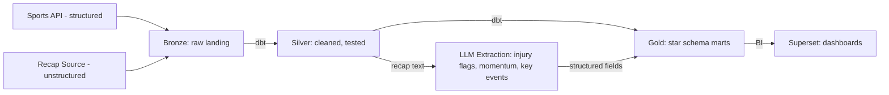

# Diagrams

Whimsical is the primary format for diagrams in this project - cloud-hosted and directly editable at the link below, no export/import needed to update it. Mermaid versions are kept here as a local, version-controlled fallback: they live in this file (so they're in git regardless of Whimsical access), render natively on GitHub, and can be opened for online editing at the live-edit link.

## Pipeline Architecture

**Whimsical (primary, cloud-editable):** https://whimsical.com/5yjLz9kUwC1vK6DN8KVczM

**Mermaid (local, in-repo fallback):**

Edit online (Mermaid Live): https://mermaid.ai/live/edit?utm_source=claude_widget&utm_medium=embed&utm_campaign=claude#pako:eNptkM9OwzAMxl/F6rl9gR6QmITQpCKh9Zj14CZeW8ifyknGBuPdSRMEB8jBdpLv9znORyWdoqqtJsZ1hu5wtJAWrovoV8fBw/3zHhrwgaMMkUkN0DR3MLKz7yR2ObXA+AYarVrsNBQHJomrOGwRehdZUnKJ9n+fgpR6O76pMdzAL/pMLPqcWpCa0JKqIZAPiS9QEWUot0y3l8RqbUTXPcHDJTDKsDjbwmJfIl/hpHHyNRhnyIZoanilK9A5bfxfz/yQyWklHlNo0z8gg5czGQSD/IOkfln/Ox+cFtLKF7qItiqrdvs0XVyJPQXRfxctKPTz6JCVH6rPL2Lejvs=

